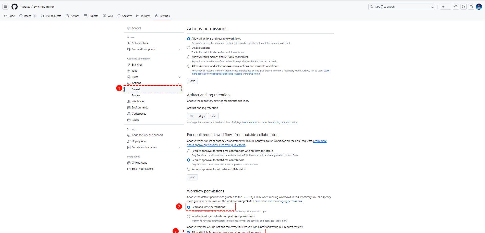
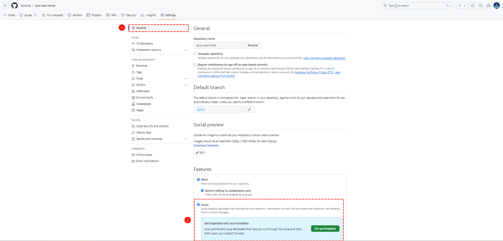
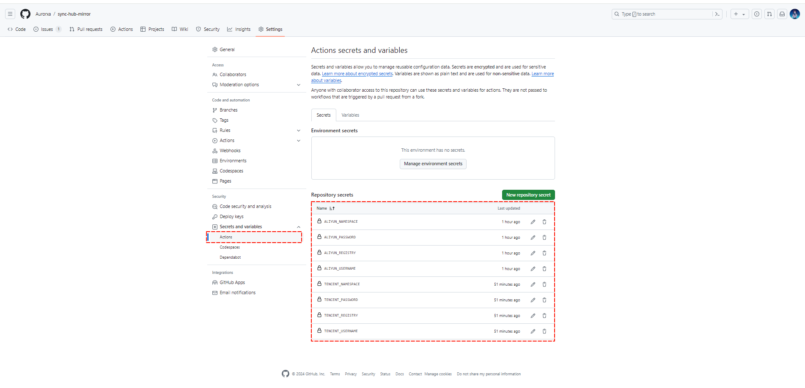

# sync-hub-mirror
##  需要配置的 `secrets` ，不同的目标仓库配置参数：

* Docker Hub（暂未实现）

| Secret 名称           | 用途                    | 是否必须 |
| --------------------- | ----------------------- | -------- |
| `DOCKERHUB_USERNAME`  | Docker Hub 用户名       | √        |
| `DOCKERHUB_PASSWORD`  | Docker Hub 密码         | √        |
| `DOCKERHUB_REGISTRY`  | Docker Hub 镜像仓库地址 | ×        |
| `DOCKERHUB_NAMESPACE` | Docker Hub 镜像命名空间 | √        |

* 阿里云（测试通过）

| Secret 名称        | 用途                 | 是否必须                                    | 示例         |
| ------------------ | -------------------- | ------------------------------------------- | ------------ |
| `ALIYUN_USERNAME`  | 阿里云镜像仓库用户名 | √                                           | abcefg       |
| `ALIYUN_PASSWORD`  | 阿里云镜像仓库密码   | √                                           | 123456       |
| `ALIYUN_REGISTRY`  | 阿里云镜像仓库地址   | ×，默认是 registry.cn-hangzhou.aliyuncs.com |              |
| `ALIYUN_NAMESPACE` | 阿里云镜像命名空间   | √                                           | aexia/docker |

* 腾讯云（测试通过）

| Secret 名称         | 用途                 | 是否必须                         | 示例         |
| ------------------- | -------------------- | -------------------------------- | ------------ |
| `TENCENT_USERNAME`  | 腾讯云镜像仓库用户名 | √                                | abcefg       |
| `TENCENT_PASSWORD`  | 腾讯云镜像仓库密码   | √                                | 123456       |
| `TENCENT_REGISTRY`  | 腾讯云镜像仓库地址   | ×，默认是 ccr.ccs.tencentyun.com |              |
| `TENCENT_NAMESPACE` | 腾讯云镜像命名空间   | √                                | aexia/docker |

* 华为云

| Secret 名称        | 用途                 | 是否必须                                   |
| ------------------ | -------------------- | ------------------------------------------ |
| `HUAWEI_USERNAME`  | 华为云镜像仓库用户名 | √                                          |
| `HUAWEI_PASSWORD`  | 华为云镜像仓库密码   | √                                          |
| `HUAWEI_REGISTRY`  | 华为云镜像仓库地址   | ×，默认是 swr.cn-north-4.myhuaweicloud.com |
| `HUAWEI_NAMESPACE` | 华为云镜像命名空间   | √                                          |

* 自定义：

| Secret 名称        | 用途                 | 是否必须 | 示例                                                         |
| ------------------ | -------------------- | -------- | ------------------------------------------------------------ |
| `CUSTOM_USERNAME`  | 自定义镜像仓库用户名 | √        | abcdef                                                       |
| `CUSTOM_PASSWORD`  | 自定义镜像仓库密码   | √        | 123456                                                       |
| `CUSTOM_REGISTRY`  | 自定义镜像仓库地址   | √        | quay.io                                                      |
| `CUSTOM_NAMESPACE` | 自定义镜像命名空间   | √        | library（在 Harbor 是项目名称，在 quay.io 中是用户名，也可以是其他的） |

## 仓库权限设置

* ① 开启 workflow permission 权限：

* ② 开启 issue ：

* ③ 配置 secret ：

