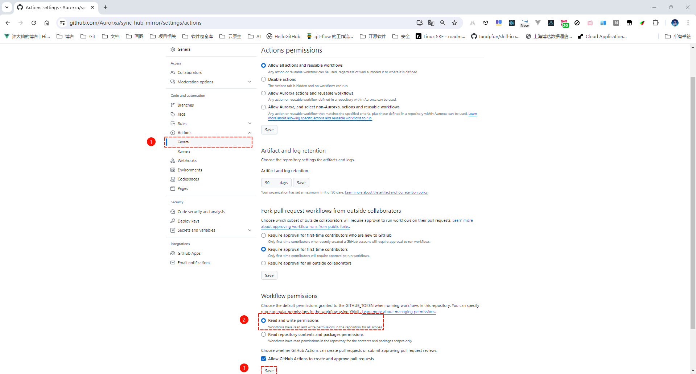
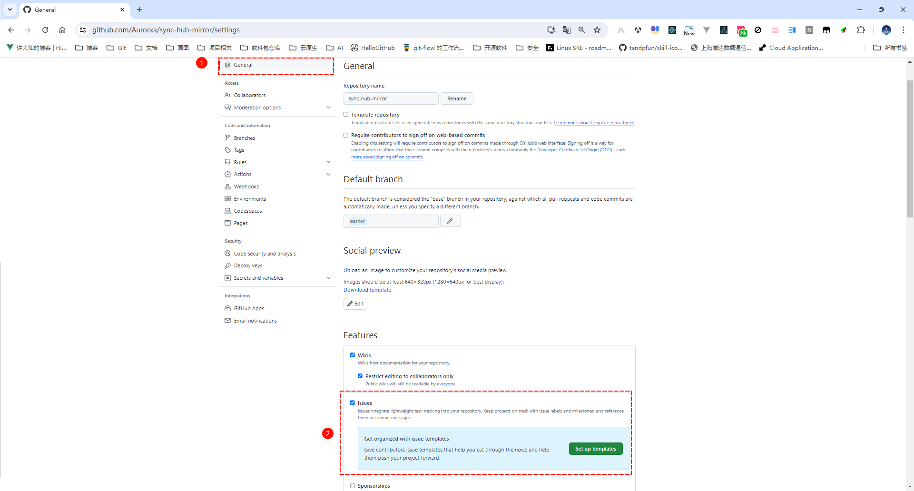

# sync-hub-mirror
##  需要配置的 `secrets` ，根据不同的目标仓库分别列出：

### Docker Hub

| Secret 名称          | 用途                             |
|----------------------|----------------------------------|
| `DOCKERHUB_USERNAME` | Docker Hub 用户名                |
| `DOCKERHUB_PASSWORD` | Docker Hub 密码                  |

### 阿里云（测试通过）

| Secret 名称        | 用途                 | 是否必须                                    |
| ------------------ | -------------------- | ------------------------------------------- |
| `ALIYUN_USERNAME`  | 阿里云镜像仓库用户名 | √                                           |
| `ALIYUN_PASSWORD`  | 阿里云镜像仓库密码   | √                                           |
| `ALIYUN_REGISTRY`  | 阿里云镜像仓库地址   | ×，默认是 registry.cn-hangzhou.aliyuncs.com |
| `ALIYUN_NAMESPACE` | 阿里云镜像命名空间   | √                                           |

### 腾讯云（测试通过）

| Secret 名称         | 用途                 | 是否必须                         |
| ------------------- | -------------------- | -------------------------------- |
| `TENCENT_USERNAME`  | 腾讯云镜像仓库用户名 | √                                |
| `TENCENT_PASSWORD`  | 腾讯云镜像仓库密码   | √                                |
| `TENCENT_REGISTRY`  | 腾讯云镜像仓库地址   | ×，默认是 ccr.ccs.tencentyun.com |
| `TENCENT_NAMESPACE` | 腾讯云镜像命名空间   | √                                |

### 华为云

| Secret 名称        | 用途                 | 是否必须                                   |
| ------------------ | -------------------- | ------------------------------------------ |
| `HUAWEI_USERNAME`  | 华为云镜像仓库用户名 | √                                          |
| `HUAWEI_PASSWORD`  | 华为云镜像仓库密码   | √                                          |
| `HUAWEI_REGISTRY`  | 华为云镜像仓库地址   | ×，默认是 swr.cn-north-4.myhuaweicloud.com |
| `HUAWEI_NAMESPACE` | 华为云镜像命名空间   | √                                          |

## 仓库权限设置

* ① 开启 workflow permission 权限：

* ② 开启 issue ：

